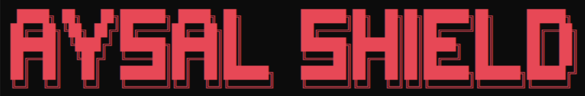
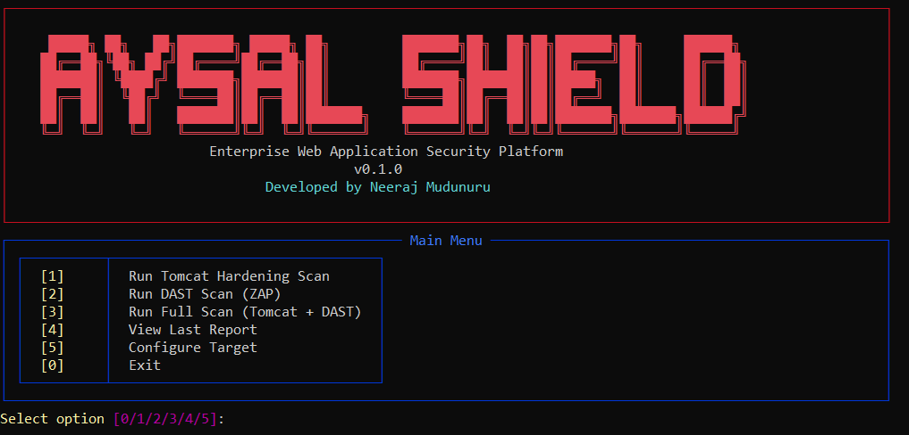
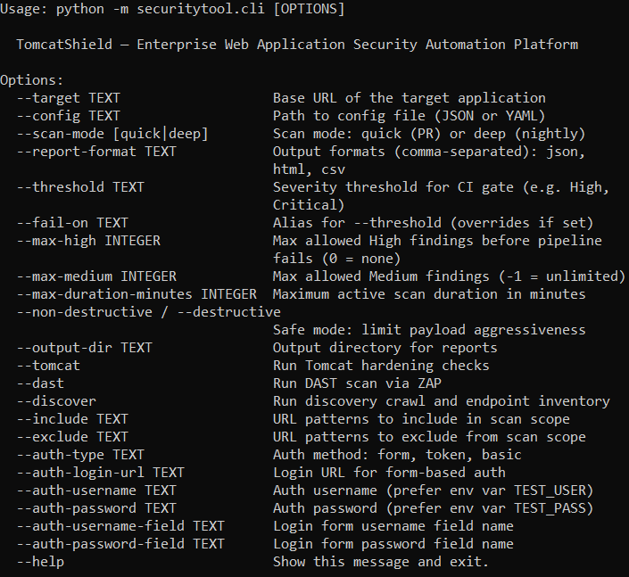

# 🛡️ Aysal Shield

### Enterprise Web Application Security Automation Platform

**v0.1.0** | Developed by [Neeraj Mudunuru](https://www.linkedin.com/in/neeraj-mudunuru-79130a29a/)

[](https://python.org)
[](https://zaproxy.org)
[](https://adoptium.net)
[](LICENSE)
[](https://github.com)

---


---

*A repeatable, policy-driven security pipeline — not a one-time scan tool.*

---

##  What is Aysal Shield?

Aysal Shield is a **CI-native application security automation platform** that provides continuous security assurance for web applications running on Apache Tomcat infrastructure.

It orchestrates the full **Dynamic Application Security Testing (DAST)** lifecycle:

- ✅ Authenticated and unauthenticated crawling
- ✅ OWASP Top 10 attack coverage via ZAP
- ✅ Apache Tomcat hardening benchmarks
- ✅ Result normalization and deduplication
- ✅ Multi-format reporting (JSON, HTML, CSV)
- ✅ CI/CD pipeline gates (fail on High/Critical)

> **Built for:** Security engineers, DevSecOps teams, and platform teams who need automated, evidence-backed security gates on every code push — without relying on manual pentests.

---

##  Quick Start

### Prerequisites

| Requirement | Version | Download |
|-------------|---------|----------|
| Python | 3.10+ | https://python.org |
| Java | 17+ | https://adoptium.net |
| OWASP ZAP | 2.17.0 | https://zaproxy.org/download |
| Git | Any | https://git-scm.com |

### Windows (Powershell)

```powershell
git clone https://github.com/Rolex-1905/aysal-shield.git
cd aysal-shield
python -m venv venv
venv\Scripts\activate
pip install -r requirements.txt

$env:ZAP_HOME="C:\Program Files\ZAP\Zed Attack Proxy"
$env:TEST_USER="your_test_username"
$env:TEST_PASS="your_test_password"

python -m securitytool.cli --help
```

### Linux

```bash
git clone https://github.com/Rolex-1905/aysal-shield.git
cd aysal-shield
python3 -m venv venv
source venv/bin/activate
pip install -r requirements.txt

export ZAP_HOME="/path/to/ZAP_2.17.0"
export TEST_USER="your_test_username"
export TEST_PASS="your_test_password"

python -m securitytool.cli --help
```

---

## CLI Preview

### Interactive Mode

```powershell
python -m securitytool.cli
```



### Help Output

```powershell
python -m securitytool.cli --help
```



---

## Running Scans

### Tomcat Hardening Only *(no ZAP required)*

```powershell
python -m securitytool.cli --target https://your-target.com --tomcat --output-dir artifacts
```

### DAST Scan — Quick *(for PR checks)*

```powershell
python -m securitytool.cli `
  --target https://your-target.com `
  --dast `
  --scan-mode quick `
  --threshold High `
  --output-dir artifacts
```

### DAST Scan — Deep *(for nightly runs)*

```powershell
python -m securitytool.cli `
  --target https://your-target.com `
  --dast `
  --scan-mode deep `
  --threshold High `
  --max-high 0 `
  --max-medium 3 `
  --output-dir artifacts
```

### Full Scan *(Tomcat + DAST + Discovery)*

```powershell
python -m securitytool.cli `
  --target https://your-target.com `
  --tomcat `
  --dast `
  --discover `
  --output-dir artifacts
```

### Using a Config File

```powershell
python -m securitytool.cli --config configs/deep_scan.json --tomcat --dast
```

---

## CLI Reference

| Flag | Description | Default |
|------|-------------|---------|
| `--target` | Base URL of the target application | — |
| `--config` | Path to JSON/YAML config file | — |
| `--scan-mode` | `quick` (PR checks) or `deep` (nightly) | `quick` |
| `--threshold` | Minimum severity for CI gate failure | `High` |
| `--fail-on` | Alias for `--threshold` | — |
| `--max-high` | Max High findings allowed (0 = none) | `0` |
| `--max-medium` | Max Medium findings (-1 = unlimited) | `-1` |
| `--max-duration-minutes` | ZAP active scan time limit | `30` |
| `--non-destructive` | Safe mode — low aggression payloads | `true` |
| `--output-dir` | Report output directory | `artifacts` |
| `--report-format` | Comma-separated: `json,html,csv` | `json,html,csv` |
| `--tomcat` | Run Tomcat hardening checks | off |
| `--dast` | Run DAST scan via ZAP | off |
| `--discover` | Run endpoint discovery crawl | off |
| `--include` | URL patterns to include in scan scope | — |
| `--exclude` | URL patterns to exclude from scan scope | — |
| `--auth-type` | Auth method: `form`, `token`, `basic` | — |
| `--auth-login-url` | Login URL for form-based auth | — |
| `--auth-username-field` | Login form username field name | `username` |
| `--auth-password-field` | Login form password field name | `password` |

---

## Architecture

Aysal Shield is a modular Python CLI platform. Each module is independently testable and replaceable.

```
aysal-shield/
├── .github/
│   └── workflows/
│       └── security-scan.yml       ← GitHub Actions pipeline
├── artifacts/                      ← scan reports (git ignored, auto-created)
├── configs/
│   ├── dev.json                    ← quick scan config
│   └── deep_scan.json              ← deep scan config
├── docs/
│   ├── images
│   │   ├── cli-help.png
│   │   ├── cli-menu.png
│   │   └── logo.png
│   ├── ARCHITECTURE.md
│   ├── AUTH_SETUP.md
│   ├── CONFIG_REFERENCE.md
│   ├── EXTENSIBILITY.md
│   ├── KNOWN_LIMITATIONS.md
│   ├── RUNBOOK.md
│   └── THREAT_MODEL.md
├── securitytool/
│   ├── ci/
│   │   └── thresholds.py           ← CI gate: fail conditions & exit codes
│   ├── dast/
│   │   ├── parsers.py              ← normalize ZAP output → internal schema
│   │   └── zaprunner.py            ← ZAP daemon lifecycle & scan execution
│   ├── discovery/
│   │   ├── crawler.py              ← unauthenticated + authenticated crawl
│   │   └── inventory.py            ← endpoint inventory builder
│   ├── reporting/
│   │   ├── csvexport.py            ← management summary CSV
│   │   ├── htmlreport.py           ← human-readable HTML report
│   │   └── jsonreport.py           ← machine-readable JSON report
│   ├── tomcat/
│   │   ├── baselinecheck.py        ← default apps, TRACE, TLS, banners
│   │   ├── headerscheck.py         ← HTTP security headers
│   │   └── webxmlcheck.py          ← session timeout, security constraints
│   │
│   ├── cli.py                      ← entry point & argument parsing
│   ├── config.py                   ← config load/validate (YAML/JSON)
│   ├── interactive.py              ← interactive menu
│   └── utils.py                    ← PII redaction, logging utilities
├── .gitignore
├── .pre-commit-config.yml
├── azure-pipelines.yml
├── gitlab-ci.yml
├── LICENSE
├── pyproject.toml
├── README.md
└── requirements.txt
```

### Data Flow

```
Target URL
    │
    ▼
┌─────────────┐      ┌──────────────┐      ┌──────────────────┐
│  Discovery  │────▶│  DAST Runner │────▶│ Parser/Normalize │
│  Crawler    │      │  (ZAP)       │      │ Dedup + Severity │
└─────────────┘      └──────────────┘      └─────────┬────────┘
                                                    │
┌─────────────┐                                     ▼
│   Tomcat    │                           ┌──────────────────┐
│  Hardening  │─────────────────────────▶│   Reporting      │
│  Scanner    │                           │ JSON / HTML / CSV│
└─────────────┘                           └────────┬─────────┘
                                                   │
                                                   ▼
                                         ┌─────────────────┐
                                         │   CI/CD Gate    │
                                         │ Pass / Fail ≥ X │
                                         └─────────────────┘
```
---

## Reports

All reports are written to `artifacts/` (auto-created at runtime):

| File | Format | Audience |
|------|--------|----------|
| `security_report_<timestamp>.html` | HTML | Developers, security engineers |
| `security_report_<timestamp>.json` | JSON | SIEM, downstream tooling |
| `security_report_<timestamp>.csv` | CSV with executive summary | Management, compliance |
| `discovery_inventory_<timestamp>.json` | JSON | Security engineers |

### Severity Levels

| Level | Meaning | CI Gate Action |
|-------|---------|----------------|
| 🔴 Critical | Confirmed high-impact (SQLi, RCE) | Fail immediately |
| 🟠 High | High-risk finding | Fail pipeline |
| 🟡 Medium | Medium-risk finding | Warning (configurable) |
| 🔵 Low | Low-risk finding | Informational |
| ⚪ Informational | No direct risk | No action |

---

## What Gets Tested

### DAST Coverage (via OWASP ZAP)
- Cross-Site Scripting (XSS)
- SQL Injection (SQLi)
- Path Traversal
- Server-Side Request Forgery (SSRF)
- Open Redirect
- Sensitive Information Disclosure

### Tomcat Hardening Checks
- HTTP Security Headers (CSP, HSTS, X-Frame-Options, X-Content-Type-Options, Referrer-Policy)
- Default application exposure (`/manager`, `/host-manager`)
- Server banner suppression
- TRACE method disabled
- TLS version and cipher suite validation
- Session cookie flags (HttpOnly, Secure)
- Security constraints and transport guarantee
- Error page information disclosure

---

## CI/CD Integration

### GitHub Actions

The pipeline runs automatically on every PR (quick scan) and nightly on main (deep scan).

```yaml
# .github/workflows/security-scan.yml
on:
  push:
    branches: [main]
  pull_request:
  schedule:
    - cron: '0 2 * * *'   # nightly at 2AM
```

Pipeline behavior:
- **PR** → quick scan, fails on any High/Critical finding
- **Nightly** → deep scan, full OWASP policy, artifact upload

### GitLab CI

```yaml
# gitlab-ci.yml included in repo root
```

### Azure DevOps

```yaml
# azure-pipelines.yml included in repo root
```

---

## Security & Compliance

| Rule | Enforcement |
|------|-------------|
| Only scan authorized environments | Config-level scope enforcement |
| Never use production credentials | Pre-commit hook blocks plaintext passwords |
| Secrets via environment variables | `${TEST_USER}` / `${TEST_PASS}` substitution |
| PII redacted from all reports | `redact_pii()` applied to all outputs |
| Critical/High findings → security channel | Threshold gate + non-zero exit code |
| Reports are internal-confidential | Access controls apply |

---

## Documentation

| Document | Description |
|----------|-------------|
| [ARCHITECTURE.md](docs/ARCHITECTURE.md) | Module architecture, data flow, and interface contracts |
| [AUTH_SETUP.md](docs/AUTH_SETUP.md) | Authentication setup (form, token, basic) |
| [CONFIG_REFERENCE.md](docs/CONFIG_REFERENCE.md) | All config parameters, types, and defaults |
| [EXTENSIBILITY.md](docs/EXTENSIBILITY.md) | How to add new checks, parsers, and formats |
| [KNOWN_LIMITATIONS.md](docs/KNOWN_LIMITATIONS.md) | Known limitations and workarounds |
| [RUNBOOK.md](docs/RUNBOOK.md) | Operational runbook — scanning, troubleshooting |
| [THREAT_MODEL.md](docs/THREAT_MODEL.md) | Threat model — assets, entry points, risks, mitigations |

---

## Common Errors

| Error | Cause | Fix |
|-------|-------|-----|
| `ZAP not found` | ZAP_HOME not set | Set `$env:ZAP_HOME` (Windows) or `export ZAP_HOME` (Linux) |
| `ZAP not ready` after 24 retries | Stale `.homelock` file | Delete `.homelock` from your ZAP home directory |
| `Environment variable not set` | TEST_USER or TEST_PASS missing | Set env vars before running any scan |
| `Got unexpected extra argument` | Space in URL | Wrap URL in quotes: `--target "https://..."` |
| `ModuleNotFoundError` | venv not activated | Run `venv\Scripts\activate` (Windows) or `source venv/bin/activate` (Linux) |
| `Spider stuck at 0%` | Target unreachable | Check network connectivity to the target |

---

## Out of Scope

The following are **not** covered by Aysal Shield unless explicitly configured:

- Full Static Application Security Testing (SAST)
- Malware and binary scanning
- Infrastructure or network penetration testing
- Destructive or availability-impacting testing
- Production environment scanning *(requires separate written sign-off)*

---

**Aysal Shield** — Enterprise Web Application Security Automation Platform

v0.1.0 | Developed by [Neeraj Mudunuru](https://www.linkedin.com/in/neeraj-mudunuru-79130a29a/)
